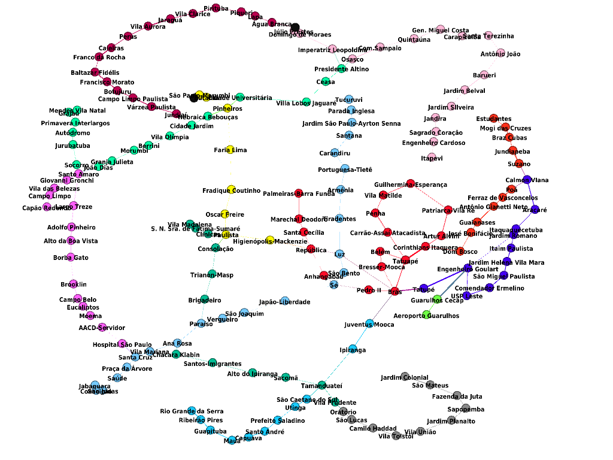

# **Caminhos Rápidos e Inclusivos: Uma Abordagem Algorítmica no Metrô de São Paulo**

Trabalho Final para a disciplina de Algoritmos e Estruturas de Dados II.  

## 🎯Objetivo 

A pesquisa utiliza a Teoria dos Grafos para modelar o mapa do Companhia de metrôs e trens de São Paulo. Portanto, estuda as conexões entre as estações e analisar o tempo necessário para ir de uma estação de partida até outra de chegada. O projeto utiliza dois grafos: um grafo que leva em conta somente o tempo de percurso e o grafo auxiliar que considera, adicionalmente, a existência ou não de elevador e rampa.

O trabalho utiliza a linguagem de programação Python e implementa o algoritmo de Dijkstra para identificar a trajetória mais rápida entre dois terminais.

A seguir, será mostrado uma representação do mapa do metro aplicado em grafos. O aprofundamento do estudo está detalhado no artigo disponível neste repositório do GitHub.

    

##  👾Compilação e Execução

Para tanto, temos as seguintes diretrizes de execução:

| Comando                |  Algoritmo                                                                                           |                     
| -----------------------| ------------------------------------------------------------------------------------------------- |
|  python3      "metro.py"          | execução do código completo                                        |

### Contato 

  
 Anna Laura Moura Santana

 <a href="https://t.me/annalaurams">
  
 

<a style="color:black" href="mailto:nalauramoura@gmail.com?subject=[GitHub]%20Source%20Dynamic%20Lists">
✉️ <i>nalauramoura@gmail.com</i>
</a>