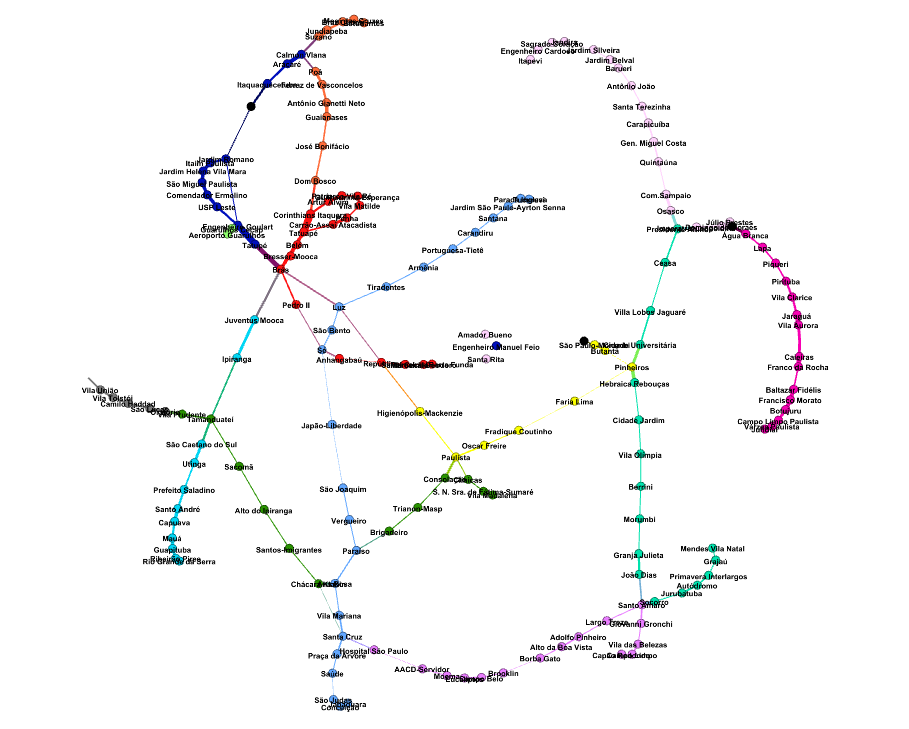
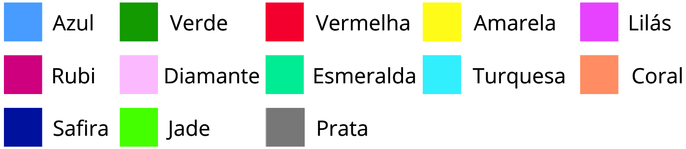

# 🚇 Uma Abordagem Inclusiva para Otimização de Trajetos em Sistemas de Transporte Público  
### *Um Estudo de Acessibilidade por Teoria dos Grafos*

---

## Sobre o Projeto

Este trabalho apresenta uma abordagem computacional **inclusiva** para a determinação de trajetos em sistemas de metrô e trem, com foco na **acessibilidade para pessoas com deficiência**.  

Baseado na **Teoria dos Grafos**, o algoritmo busca **otimizar o tempo de deslocamento**, considerando não apenas a rapidez do percurso, mas também a **presença de recursos de acessibilidade**, como elevadores e rampas.  

A análise preliminar dos resultados mostra que, ao incorporar esses critérios, há um aumento no tempo total de viagem — evidenciando **deficiências estruturais** no transporte público em termos de acessibilidade.  

Este estudo contribui para o debate sobre **infraestrutura urbana inclusiva**, destacando a importância de uma abordagem computacional que valorize a **igualdade de acesso e mobilidade**.


### 🔹 Grafo Rede Metroferroviária de São Paulo




### Exemplo de Ligações — Linha Amarela
A imagem a seguir ilustra um **recorte da Linha Amarela**, destacando as conexões entre suas estações e o formato circular de ligação entre os pontos principais.


---

##  👾Compilação e Execução

O algoritmo desenvolvido através da IDE Visual Studio no sistema operacional Linux, com a versão Python 3.10.12 

O código disponibilizado pode ser executado no sistema operacional Linux e Windows, sendo necessário informar a versão Python instalada em seu computador. O algoritmo também pode ser executado pelo Google Colab.

Caso necessário instalar bibliotecas, as utilizadas nesta implementação foram: ```pandas```  ```networkx```  ```csv```  ```sys```  ```matplotlib.pyplot```  ```defaultdict```  ```heapq```   ```time```.

Para tanto, temos as seguintes diretrizes de execução:

| Comando                |  Algoritmo                                                                                           |                     
| -----------------------| ------------------------------------------------------------------------------------------------- |
|  python3      codigo.py          | Execução do código completo                                        |


## Contato

<div align="left">

👩‍💻 **Anna Laura Moura Santana**  
✉️ [nalauramoura@gmail.com](mailto:nalauramoura@gmail.com?subject=[GitHub]%20Otimização%20de%20Trajetos%20-%20Grafos)  
🌐 [LinkedIn](https://www.linkedin.com/in/annalaurams) | [GitHub](https://github.com/annalaurams)

</div>

